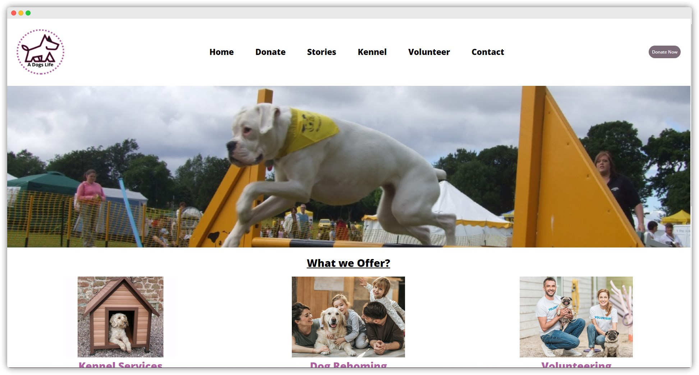

<!-- ABOUT THE PROJECT -->
<a href="https://danielmustard.github.io/ADogsLife-HNC-Unit10/"><strong>Take a look at the site »</strong></a>

## About The Project

This is a project I was required to do as a part of a module within my HNC. This opportunity allowed me to learn more about flex boxes for positioning content on a webpage. I also learned how to style using SASS. I found SASS so much more convenient than CSS for this project as it allows styles to be split up into parts for each component.